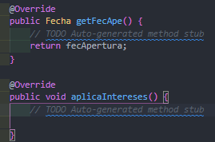

## Decorator
El patrón Decorator responde a la necesidad de añadir dinámicamente funcionalidad a un   Objeto. Esto nos permite no  tener que crear sucesivas clases que hereden de la primera  incorporando la nueva funcionalidad, sino otras que la implementan y se asocian a la primera.

### Acontinuación explicaremos lo que es el ejercicio  de la practica que teniamos que realizar.

Primero explicaremos la clase cliente, en esta clase lo que se hace es crear las variables que utilizaremos de tipo privado, posteriormete lo que es un constructor lleno que se llama cliente y para terminar esta  clase creamos los metodos obtenedores y establecedores de cada uno.

Ahora explicaremos lo que es la interface del ejercicio ya que es primordial para este patron, la interfaz lo que hace en general es crear las funciones cliente y la fecha además de las funciones  ingresar y retirar para que puedan ser implementada por una clase

La clase Decorador esta clase implementa todo de la intefaz cuenta donde le  damos todas las funcionalidades a cada función, en pocas palabras darnos las instrucciones u órdenes de que hacer es decir lo que se va realizar.

La clase CuentaCorriente esta clase hereda de la clase Docorador ya que necesimatas  implementar el saldo, en esta clase creamos un constructor donde instanciamos  la cuenta, despues creamos una función de tipo string esta nos servira para crear la cuenta,  posteriormente una función de tipo void para lo que es aplicar los interese a una cuenta  en este caso a una corriente y por ultimo una función de tipo string para que nos retorne la tarjeta.

la clase cuentaGeneral esta implementa la interfaz que es cuenta donde esta genera  todas las funciones de ella, ademas de que creamos un constructor lleno para saber de cuanto  es el saldo inicial, cliente y la fecha.

La clase fecha en esta lo primero que hacemos es declarar las variables que utilizaremos   luego crearemos lo que es un constructor lleno, este nos servira para dar  la fecha en entero, despues otro de tipo string usando la herramienta de Stringtokenizer  que sirve para dividir las cade en tokens es decir en pequeño fragmento, luego le decimos que los divida con "/" luego declaramos las 3 variables que utilizamos y la igualamos y por ultimo la convertimos a entero, despues creamos una funcion fecha esta   servira para que nos de la fecha en tiempo real y por ultimo creamos todos los  obtenedores y establecedores.

Por ultimo la clase PruebaPtron en esta es para probar todo el ejercio lo primero que hacemos es instanciar la fecha luego cliente esto sera para el  primer cliente que será juan ha ambas intanciaciones le pasamos los parametro  requerido, esto mismo hacemos para el segundo cliente.

Despues seguimos con instanciar las cuenta una para cada cliente estás  seran cuenta generales, despues instanciamos la cuenta corrientes  y le pasamos sus parametros correspondiente y por ultimo la cuenta de plazo tambien  con todos sus parametros y para finalizar utilizamos la instancia de decorator y llamamos a la funcuncion  de aplicarIntereses para compilar ya que ahi hice la funcion y el mensaje que mostrara por pantalla.

Ahora podemos ver el resultado:

